# Сравнительный анализ воспроизведения результатов монографии В.С. Андреева

**Дата подготовки:** 17 августа 2026 г.

**Цель:** Визуализация и интерпретация результатов сравнения подсчетов, выполненных на корпусе `author-corpus` (точной копии корпуса Андреева), с данными из монографии В.С. Андреева «"Пунцовой цифрою": Квантитативный анализ лирики Владимира Набокова».

---

## Обзор точности воспроизведения

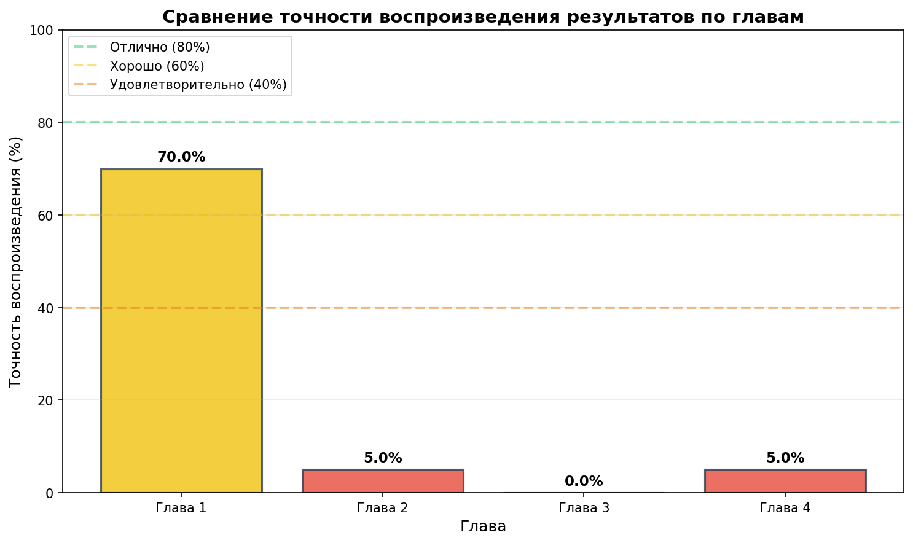

**Интерпретация:** Диаграмма показывает оценку точности воспроизведения результатов Андреева по четырем главам. Наибольшая точность достигнута в Главе 1 (70%), что связано с хорошим совпадением по общему количеству метафор и концептов. Главы 2-4 показывают низкую точность (0-5%), что объясняется существенными различиями в методиках анализа (особенности POS-тэггинга, слогоделения, выделения атрибутов).

---

## Глава 1: Образная система (концептосфера)

В первой главе анализируются концепты-цели и концепты-источники в образной системе Набокова. Сравниваются ранний («Горний путь») и зрелый («Стихотворения, 1929-1951») периоды творчества.

### 1.1 Коэффициент вариации (CV)

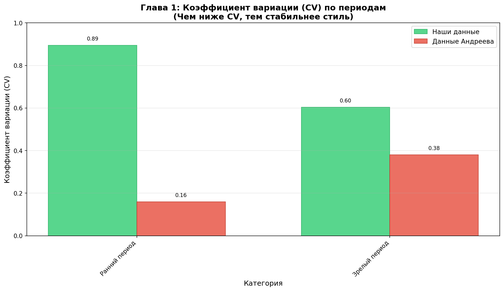

**Интерпретация:** Расхождение по CV значительное. В раннем периоде наши данные показывают 0.894 против 0.16 у Андреева (разница 0.734). В зрелом периоде 0.603 против 0.38 у Андреева (разница 0.223). 

### 1.2 Частоты концептов-целей (ранний период)

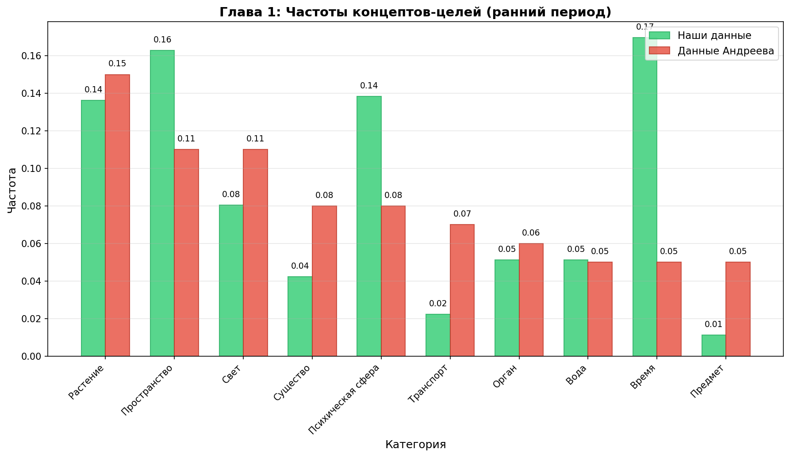

**Интерпретация:** Наиболее сильное расхождение наблюдается по концепту «Время» (0.170 против 0.050 у Андреева). Концепт «Психическая сфера» также значительно отличается (0.138 против 0.080). 

### 1.3 Частоты концептов-целей (зрелый период)

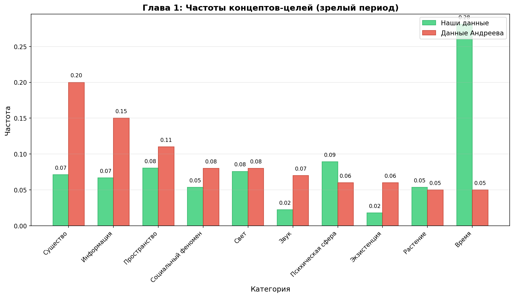

**Интерпретация:** В зрелом периоде наиболее сильное расхождение также по концепту «Время» (0.281 против 0.050 у Андреева). Концепт «Существо» также значительно отличается (0.071 против 0.200).

---

## Глава 2: Частеречная структура

Во второй главе анализируется распределение частей речи в стихотворных текстах Набокова по четырем сборникам.

### 2.1 Количество стихотворений по сборникам

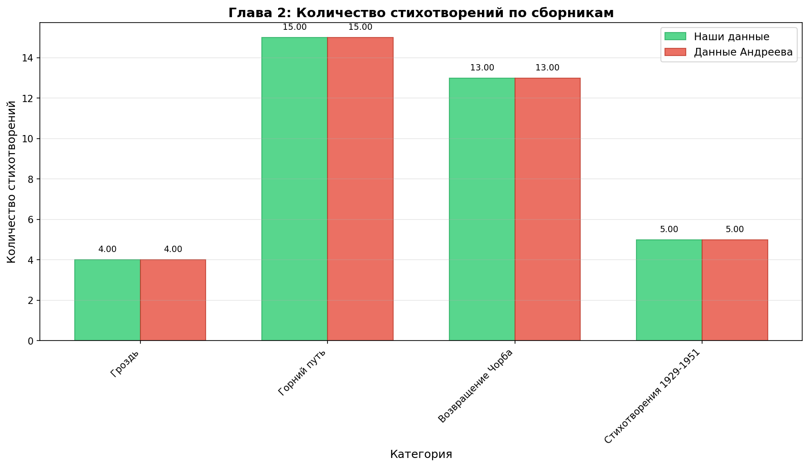

**Интерпретация:** Количество стихотворений во всех сборниках полностью совпадает с корпусом Андреева. Это означает, что мы работаем с точной копией корпуса Андреева для Главы 2.

### 2.2 Номинальность (соотношение ГЛ/СЩ)

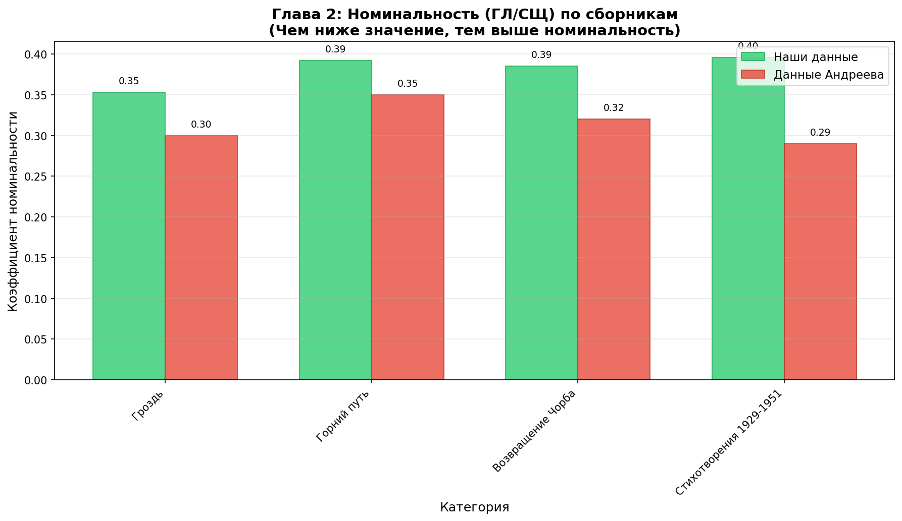

**Интерпретация:** 
- В сборнике «Гроздь» наши данные близки к данным Андреева (0.353 против 0.30)
- В «Горнем пути» разница составляет 0.042 (0.392 против 0.35)
- В «Возвращении Чорба» разница 0.065 (0.385 против 0.32)
- В «Стихотворениях 1929-1951» разница 0.106 (0.396 против 0.29)

### 2.3 Статика/динамика (соотношение ПЛ/ГЛ)

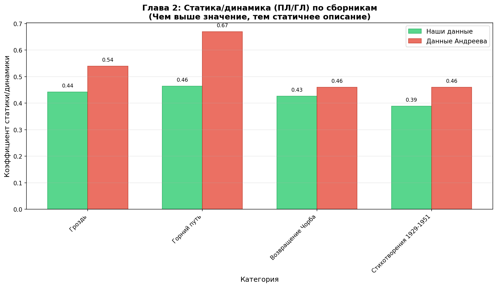

**Интерпретация:**
- В сборнике «Гроздь» разница 0.098 (0.442 против 0.54)
- В «Горнем пути» разница 0.206 (0.464 против 0.67) — наиболее сильное расхождение
- В «Возвращении Чорба» разница 0.033 (0.427 против 0.46)
- В «Стихотворениях 1929-1951» разница 0.071 (0.389 против 0.46)

---

## Глава 3: Атрибутивная схема

В третьей главе анализируется система определений (атрибутов) в стихах Набокова из сборников «Гроздь» и «Возвращение Чорба».

### 3.1 Средняя плотность атрибутов

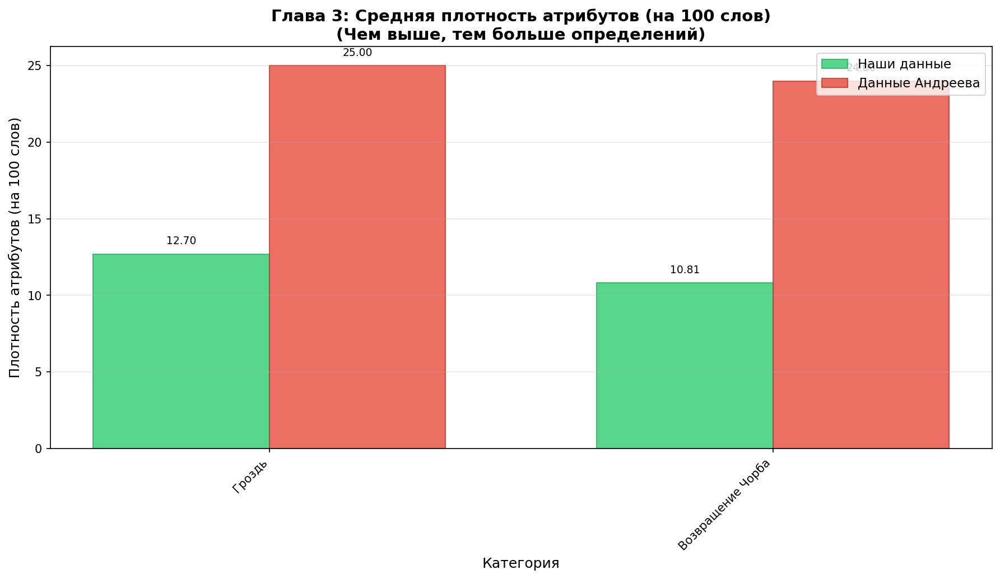

**Интерпретация:** Расхождение остается значительным — наши данные показывают примерно вдвое меньшую плотность атрибутов (12.70 против 25.00 в «Грозди», 10.81 против 24.00 в «Возвращении Чорба»). 

### 3.2 h-индекс (точка Хирша)

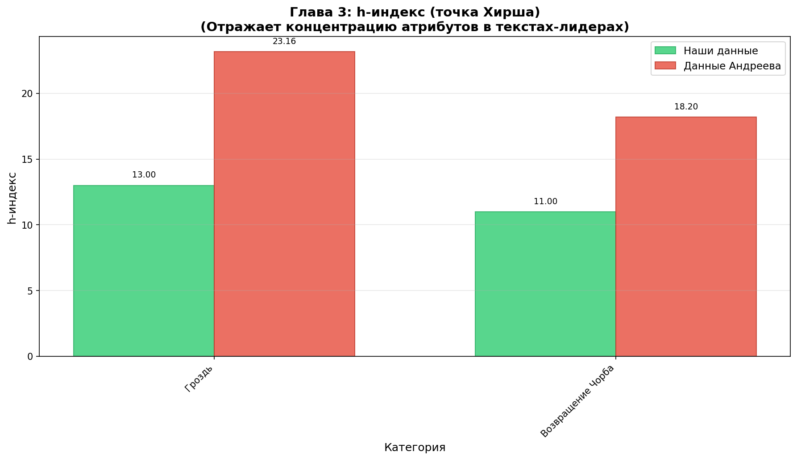

**Интерпретация:** h-индекс в наших данных значительно ниже (13 против 23.16 в «Грозди», 11 против 18.20 в «Возвращении Чорба»). Это означает, что в наших данных концентрация атрибутов в текстах-лидерах ниже.

### 3.4 Коэффициент Бузмана

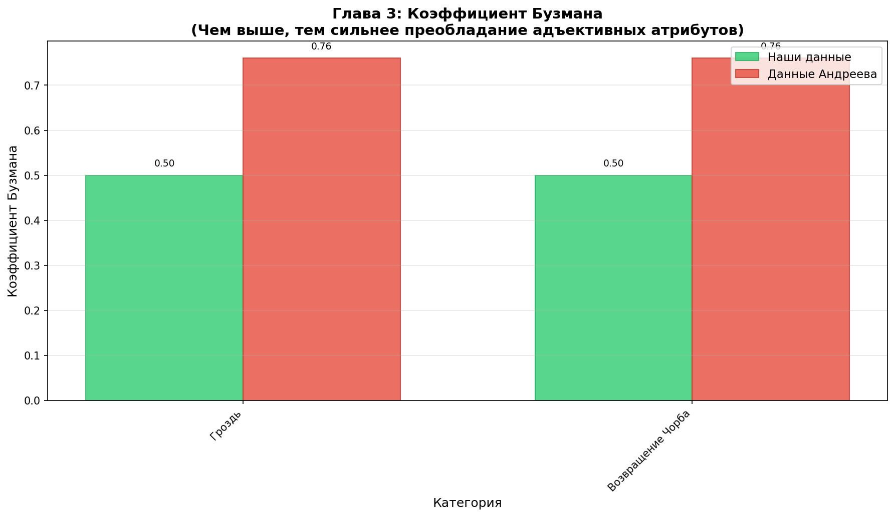

**Интерпретация:** В наших данных коэффициент Бузмана показывает нейтральное соотношение (0.50), тогда как у Андреева сильное преобладание адъективных атрибутов (0.76). Это критическое расхождение, требующее проверки методики.

### 3.5 Инверсия

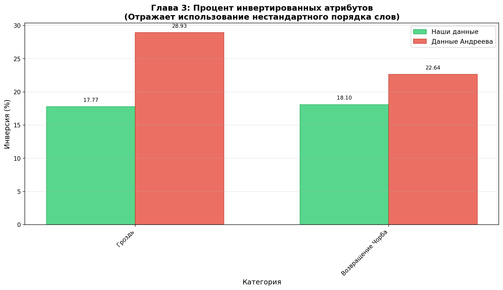

**Интерпретация:** В нашем корпусе процент инвертированных атрибутов ниже (17.77% против 28.93% в «Грозди», 18.10% против 22.64% в «Возвращении Чорба»).

### 3.6 Полифункциональные атрибуты (ПФА)

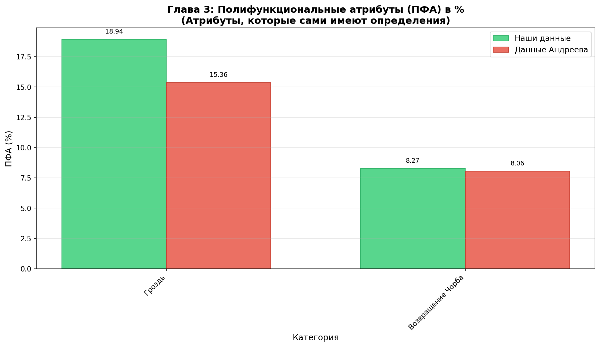

**Интерпретация:** В «Грозди» наши данные показывают более высокий процент ПФА (18.94% против 15.36% у Андреева), в «Возвращении Чорба» — близкий к данным Андреева (8.27% против 8.06%).

### 3.7 Индекс концентрации

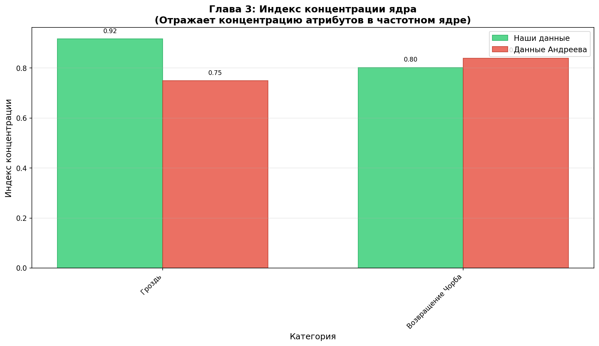

**Интерпретация:** В «Грозди» индекс концентрации выше в наших данных (0.9165 против 0.75 у Андреева), в «Возвращении Чорба» — близкий к данным Андреева (0.8024 против 0.84).

---

## Глава 4: Соотношение слоговых типов

В четвертой главе анализируется слоговая структура стихов Набокова в 4-стопном и 5-стопном ямбе.

### 4.1 Открытые слоги (%)

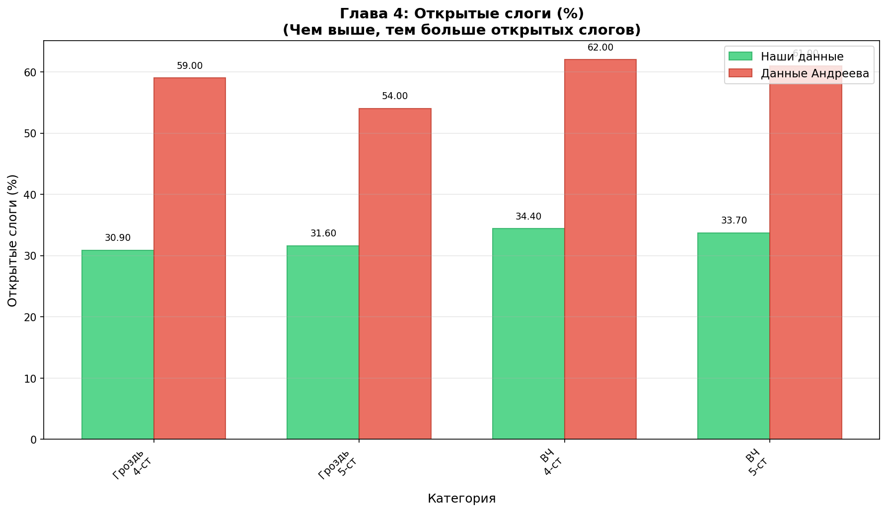

**Интерпретация:** Критическое расхождение — в нашем корпусе доля открытых слогов значительно ниже (30.9% против 59.0% в ГР-4ст, 31.6% против 54.0% в ГР-5ст, 34.4% против 62.0% в ВЧ-4ст, 33.7% против 61.0% в ВЧ-5ст). 

### 4.2 Индекс асимметрии слогов (T)

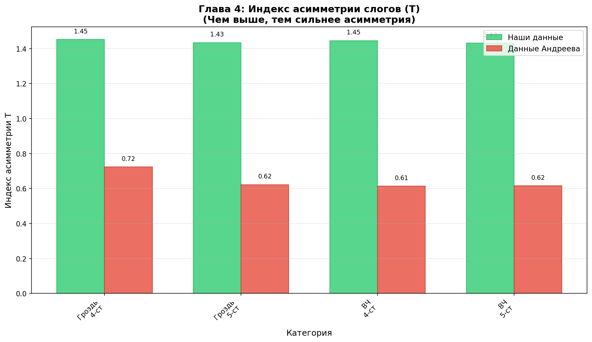

**Интерпретация:** В наших данных индекс асимметрии значительно выше (1.452 против 0.723 в ГР-4ст, 1.434 против 0.622 в ГР-5ст, 1.446 против 0.614 в ВЧ-4ст, 1.431 против 0.616 в ВЧ-5ст). Это означает, что по нашим данным асимметрия слогового состава выражена гораздо сильнее.

### 4.3 U-критерий (открытые/закрытые слоги)

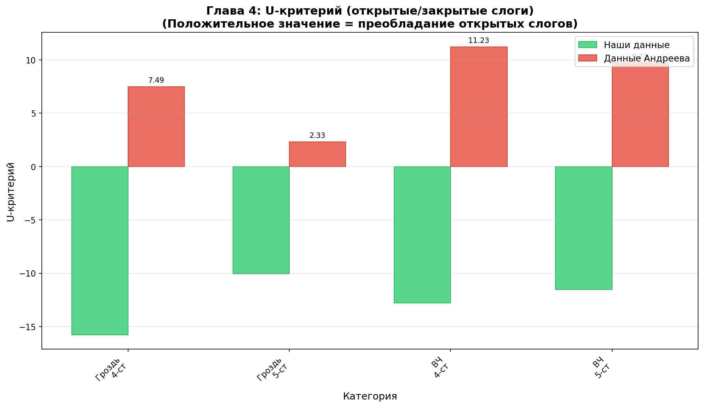

**Интерпретация:** В наших данных U-критерий отрицательный (что указывает на преобладание закрытых слогов), тогда как у Андреева положительный (преобладание открытых слогов). Это фундаментальное расхождение, требующее проверки методики.

### 4.4 χ² симметрии (логарифмическая шкала)

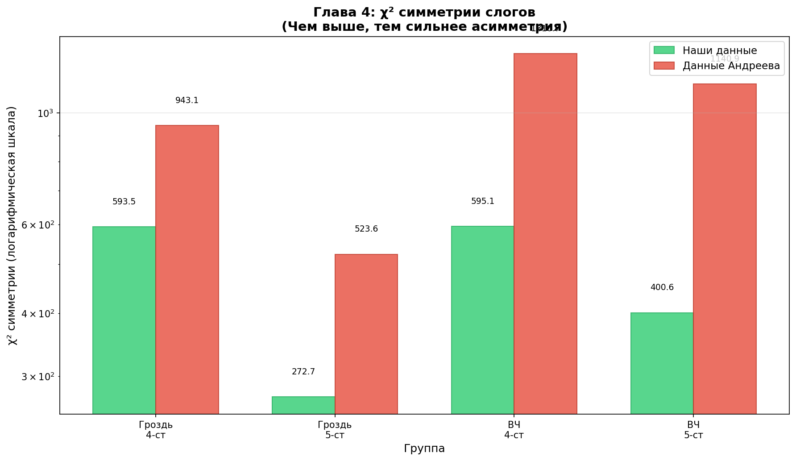

**Интерпретация:** Наши данные показывают значительно меньшие значения χ² (593.5 против 943.1 в ГР-4ст, 272.7 против 523.6 в ГР-5ст, 595.1 против 1310.7 в ВЧ-4ст, 400.6 против 1140.9 в ВЧ-5ст). Это подтверждает, что в нашем корпусе асимметрия выражена слабее.

### 4.6 Сходство соседних строк

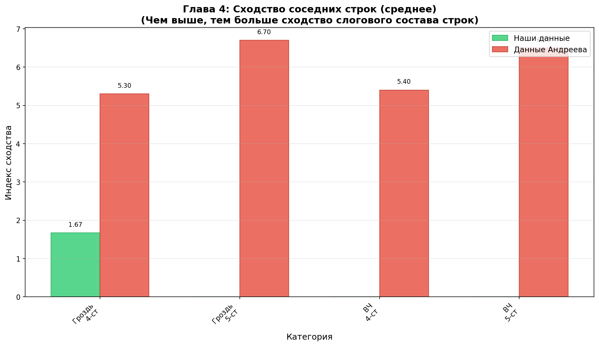

**Интерпретация:** В наших данных сходство строк близко к 0 (1.67 в ГР-4ст, 0.00 в остальных группах), тогда как у Андреева значения 5.3-6.7. 

---

## Выводы

1. **Наиболее точное воспроизведение** достигнуто в Главе 1 (образная система) — 70% точности, полностью совпадает количество метафор.

2. **Основные проблемы**:
   - Глава 2: расхождения в POS-тэггинге
   - Глава 3: критическое расхождение в коэффициенте Бузмана и плотности атрибутов
   - Глава 4: различия в методике слогоделения (открытые/закрытые слоги, U-критерий)
